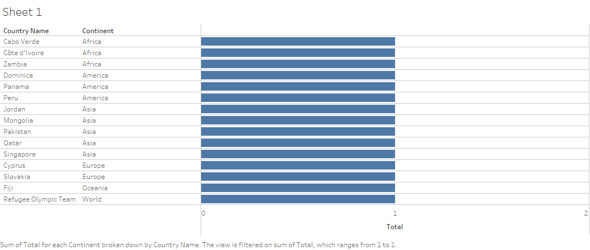
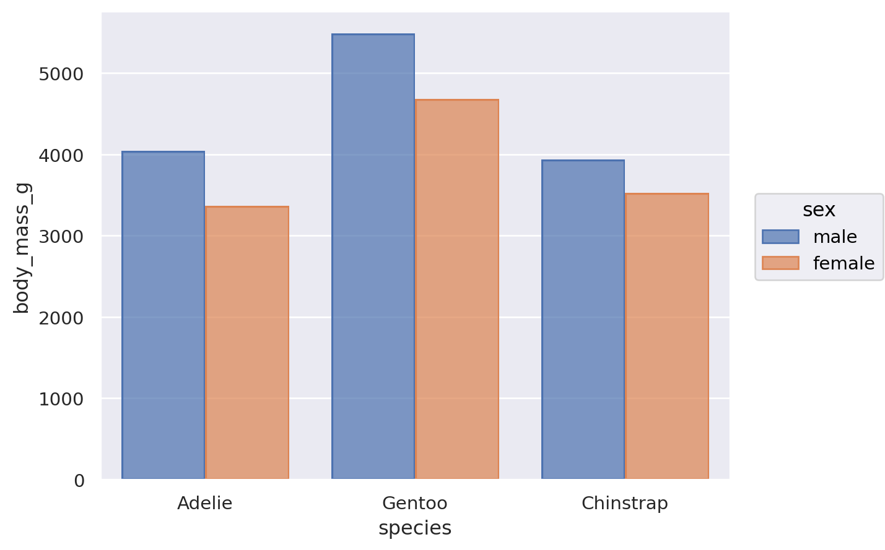
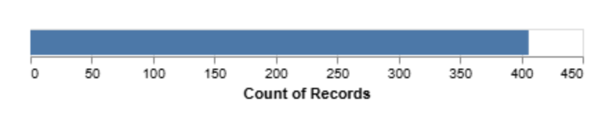

# HW 1 - CS 625, Spring 2025

John Cartwright  
Due: January 26, 2025

## Git, GitHub

*What is the URL of the GitHub repo that you created in your personal account?*

https://github.com/jbudcardi/test-setup-cs625/
   
*What is pull vs clone in GitHub?*

In GitHub, the pull command retrieves and integrates changes from a remote repo into the current branch in the local repo. The clone command copies everything from a repo and creates a local copy.
   
*You have committed a change on your local machine/remote. However, you want to undo the changes committed. How would you do that?*

First you can use the reflog command to display the commit history. When we find the commit we want to undo and it's associated ID, we can utilize git revert [commit ID] to undo that given commit. [1][2]

## Markdown

*Create a bulleted list with at least 3 items*

* One
* Two
* Three

*Write a single paragraph that demonstrates the use of italics, bold, bold italics, code, and includes a link. The paragraph must explain your favorite Olympic sport/game, the country that won the most number of olympic GOLD medals (Summer) in your favorite sport in 2020 (Japan) and 2024 (France). You are free to include more information.*

My favorite Olympic sport is *wrestling*. At the 2020 Olympics, ***Japan*** won the most gold medals in wrestling, netting **5**. In 2024, ***Japan*** again took the lead in wrestling, this time earning **8** gold medals. 

```
The links I used to find the above information are the following:
```
[2020 Olympic Wrestling](https://en.wikipedia.org/wiki/Wrestling_at_the_2020_Summer_Olympics) [3]

[2024 Olympic Wrestling](https://en.wikipedia.org/wiki/Wrestling_at_the_2024_Summer_Olympics) [4]

*Create a level 3 heading*

### This is a level 3 heading

*Insert a image of your favorite Olympics sport/game, sized appropriately*

 [5]

## Tableau

*Insert the image of your horizontal bar chart here. Reminder, this should show countries that won the least number of medals only (excluding ZERO) in Paris2024 Summer Olynpics by continent (one country from each continent is ok).*



In this table, I first organized the data in ascending order of total medals, and then removed all zero results. There were enough countries with only one medal earned, so I narrowed it to just the ones with one medal. I also organized it so they are grouped by continent. Of note, the Excel data does not delineate between North and South America, using only 'America' as a continent value. However, each continent has at least one resident country represented in the above image. [6][7]

## Google Colab

*What is the URL of your Google Colab notebook?*

https://colab.research.google.com/drive/1PSBZkAzAjjl3QIe80Nl7oPJk5D1A241z?usp=sharing

## Python/Seaborn

*Insert the first penguin chart here*


*Describe what the figure is showing.*

The figure above shows the correlation between bill length and bill depth in penguins, measured in millimeters. Based on the data clusters, we can assess that a shorter bill length is roughly correlated with a higher depth, whereas a longer bill length is roughly correlated with a smaller bill depth. [8]

*Insert the second penguin chart here*



*Describe what the figure is showing.*

The second figure shows a vertical bar chart measuring the differences, in grams, of body mass between penguins of various sub-species and sexes. Based on the figure, Gentoo measure the largest for both sexes. Adelie have the second largest measurment for males but the smallest females, whereas the Chinstrap have the lowest body mass for males and second largest for females. [8]

*What happened when you removed the outer parentheses from the code? Why?*

When you remove just the outer parentheses, the Python interpreter gives the following error:

```
 File "<ipython-input-1-d96b699d56c8>", line 9
    so.Plot(penguins, x="species", y="body_mass_g", color="sex")
    ^
IndentationError: unexpected indent
```

When you remove the indent as indicated in the above error, the Python interpreter issues yet another error:

```
  File "<ipython-input-2-2a448cefc596>", line 10
    .add(so.Bar(), so.Agg(), so.Dodge())
    ^
SyntaxError: invalid syntax
```

However, when you join the separate expressions together (i.e. removing the newline from the second snippet after removing both the parentheses and indentation), the code functions just as it had originally:

```
so.Plot(penguins, x="species", y="body_mass_g", color="sex").add(so.Bar(), so.Agg(), so.Dodge())
```

This is because in Python, a single, longer expression can be broken up into multiple lines for readbility's sake by using parentheses, as in the original expression. The '.add(...)' portion of our expression is a Seaborn function and must be appended to the first half of the expression if they are not contained within parentheses. [9]

## Observable and Vega-Lite

*What happens when you replace `markCircle()` with `markSquare()`?*

The data points on the scatterplot become squares.

*What happens when you replace `markCircle()` with `markPoint()`?*

The data points on the scatterplot remain circles but without a center, taking on a "donut" appearance.

*What change do you need to make to swap the x and y axes on the scatterplot?*

We simply need to flip our x and y arguments:

```
vl.x().fieldQ("Horsepower"),    
vl.y().fieldQ("Miles_per_Gallon"),
```

will become

```
vl.y().fieldQ("Horsepower"),    
vl.x().fieldQ("Miles_per_Gallon"),
```
Next we will remove the 'vl.y().fieldN("Origin")' statement from the car manufacturer bar chart in the notebook. This gives us the following bar chart:



*Why do you think this chart is the result of this code change?*

Since we have removed the definition for our y values, the places of origin, the single-line bar chart is simply the sum of all car models regardless of their origin.

## References
* [1] <https://git-scm.com/docs/git-reflog>
* [2] <https://www.geeksforgeeks.org/how-to-revert-a-commit-with-git-revert/>
* [3] <https://en.wikipedia.org/wiki/Wrestling_at_the_2020_Summer_Olympics>
* [4] <https://en.wikipedia.org/wiki/Wrestling_at_the_2024_Summer_Olympics>
* [5] <https://www.heraldtribune.com/story/news/2013/02/12/ioc-drops-wrestling-from-2020-olympics/29226342007/>
* [6] <https://github.com/odu-cs625-datavis/public-Spring25-aveerasa/blob/main/Paris_Olympics2024.xlsx>
* [7] <https://help.tableau.com/current/guides/get-started-tutorial/en-us/get-started-tutorial-home.htm>
* [8] <https://github.com/mcnakhaee/palmerpenguins>
* [9] <https://www.pythonmorsels.com/breaking-long-lines-code-python/>
* [10] <https://observablehq.com/@observablehq/a-taste-of-observable>
* [11] <https://observablehq.com/@observablehq/vega-lite>
