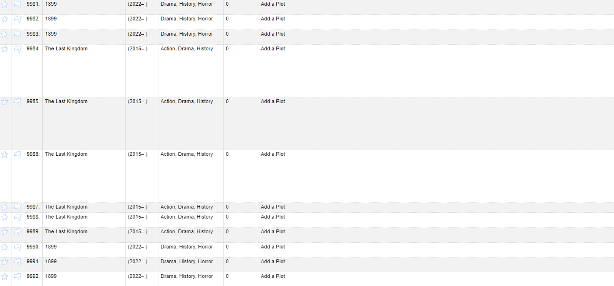
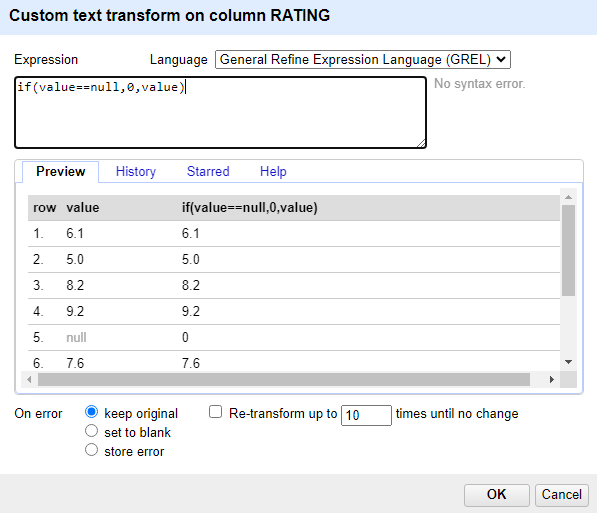
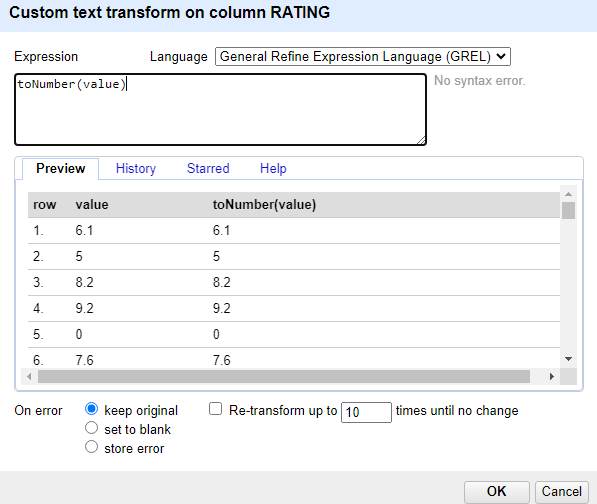
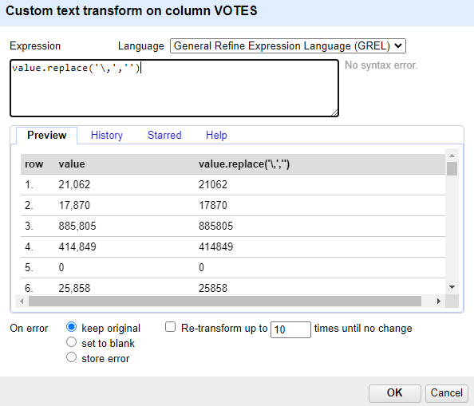
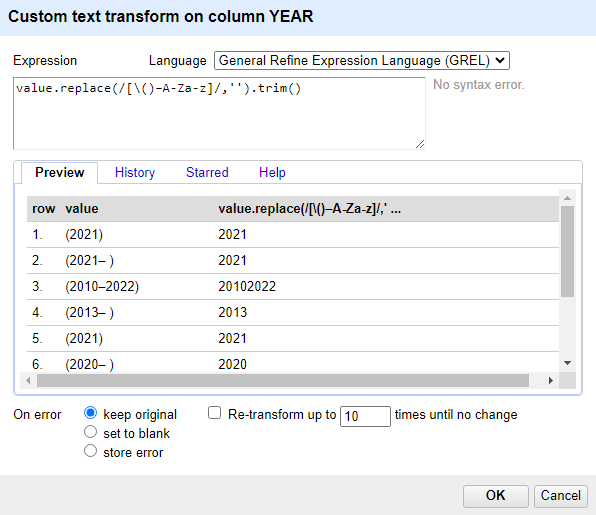
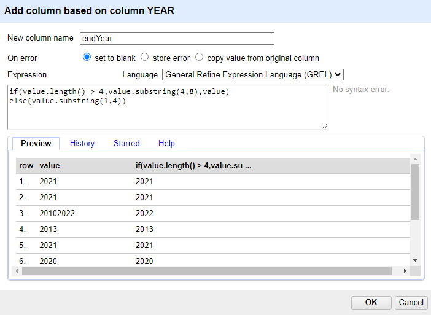
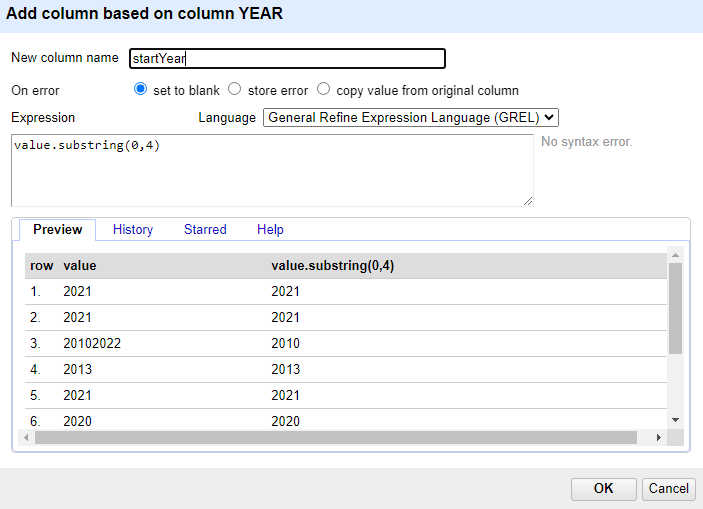

# HW 2 - CS625, Spring 2025

John Cartwright

Due: February 9, 2025

## Part 1 

After loading the movies.csv into OpenRefine and creating a project, one of the first and easiest things to check for are blank rows, using the facet by blank option in the dropdown of the "All" section in the top left. Fortunately, there are no completely blank rows in this csv:


The next obvious error I thought to look for to clean out were duplicate entries. In our data's case, we are concerned with duplicate movie titles. Jumping to the end of the dataset, we can see a number of duplicate entries:



To remedy this, we will utilize a basic Python script (remove\_duplicates.py) that will remove duplicates and return a "cleaner" csv:

```
import pandas as pd

# Read in target csv
data = pd.read_csv("movies_working.csv")

# Drop duplicate movie title rows
data = data.drop_duplicates(subset="MOVIES")

# Save new csv
data.to_csv("movies_edited.csv", index=False)
```

This took our dataset from 9999 rows to 6421 rows. Now that obvious errors have been removed, we can remove the "Gross" column and move to the next section.

Next we need to check for blanks in the Rating, Votes, and RunTime columns. We can simultaneously check for blank/null entries while replacing our target cells with 0. We can start with a GREL transform on the Rating column:



In the above expression, we check if the value in the cell is null, and if so, replace said value with 0. Now that blanks have been taken care of, we can again use transforms to ensure each entry is indeed a numerical value:



The above expression simply type casts the cell value to a numerical value. We can use the above transforms on both the Votes and RunTime columns with one caveat; several values in Votes have commas. To address this, we can utilize the following GREL expression:



This simply deletes any commas in the VOTES column entries. The toNumber function can now be applied to VOTES with no issue.

Using text facet on the YEAR column, we can see over 400 choices, including entries with words, float values, roman numerals, etc. We can manually remove the entries that are float values. Otherwise, the following regex transform will make all "non-valid" year formats blank while giving us an easier format to work with:



Next we use the "Add column based on column" dropdown option on the YEAR column. We will name it endYear and use the following conditional GREL expression to populate it's values:



Once that is created, again use the "Add column based on column" dropdown in the YEAR column, and name the new column startYear. The following GREL expression will gives us the correct values:



Now our start and end years are established. Finally, we will create Verdicts per the movie Ratings. First we can check the Ratings values through text facet, to manually remove any blanks or non-float values. Then we can create the Verdict column in the project. We can save and close the project and utilize the following Python script (rating\_verdict.py) to populate the Verdict column with appropriate string values:

```
import pandas as pd

# Read in target csv
data = pd.read_csv("movies_edited.csv")

df = pd.DataFrame(data)

# Function to determine Verdict
def determine_verdict(rating):
    if rating == 0:
        return "Not known"
    elif rating > 0 and rating <= 4.5:
        return "Flop"
    elif rating > 4.5 and rating <= 6.5:
        return "Average"
    elif rating > 6.5 and rating <= 8.0:
        return "Hit"
    elif rating > 8:
        return "Super Hit"

# Apply function to Verdict column
df['Verdict'] = df['RATING'].apply(determine_verdict)

# Save new csv
df.to_csv("movies-cleaned-final.csv", index=False)
```

Now our dataset has been cleaned and ready for further analysis.

## Part 2

1) Using text facets on startYear and Verdict columns, we find that 23 Super Hit movies were made in 2021.

2) By including 2018, 2019, and 2020 in our text facet and reverse sorting our dataset by rating, we can see the highest rated movies between 2018 and 2019. The following movies, with accompanying genre, got the highest ratings between 2018 and 2020:

* Our Planet - Documentary
* Kota Factory - Comedy
* Naui Ajusshi - Drama
* Chen qing ling - Action
* When They See Us - Biography
* The Flower of Evil - Crime
* Demon Slayer: Kimetsu No Yaiba - Animation
* Emily's Wonder Lab - Family
* Gaya sa pelikula - Romance

3) In order to get Votes by Genre, we will utilize the following Python script to group the two columns and perform summation:

```
import pandas as pd

# Read in target csv
data = pd.read_csv("movies-cleaned-final.csv")

df = pd.DataFrame(data)

df['VOTES'] = df['VOTES'].astype(int)

# Sum 'VOTES' column grouped by 'GENRE'
result = df.groupby('GENRE')['VOTES'].sum().reset_index()
sorted_df = result.sort_values(by='VOTES')

sorted_df.to_csv('votes_by_genre.txt', sep='\t', index=False)
```

The output is a txt file (votes\_by\_genre.py) with the various genres and their accompanying votes. There are hundreds of "Genre" results, which is due to the many possible combinations of different genres together. Knowing this, we will keep our top three lowest voted to one-word, non-combination genres, which are the following:

* Mystery - 156 votes
* Musical - 157 votes
* Drama - 241 votes

4) We can use a text facet for RunTime to easily find 10 minute RunTime entries. Based on the results, Goedam was highest rated but does not have the director listed. A brief search query reveals it was directed by Hong Won-ki.

* Goedam - 649  votes - Short, Horror, Mystery

5) To find the top 5 flops, we can use a text facet for Verdict and filter for Flop. Then we can sort by Votes column with the largest numbers listed first. Here are the top 5 "flops" by votes order:

* Death Note - 79452 votes
* The Human Centipede (First Sequence) - 75214 votes
* Scary Movie 5 - 67762 votes
* 365 dni - 63620 votes
* Sharknado - 47705 votes
