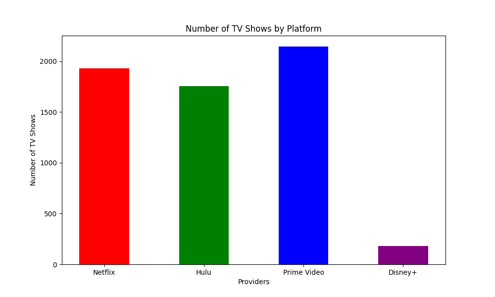
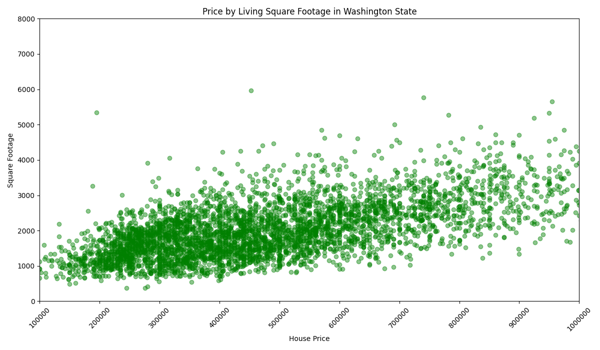
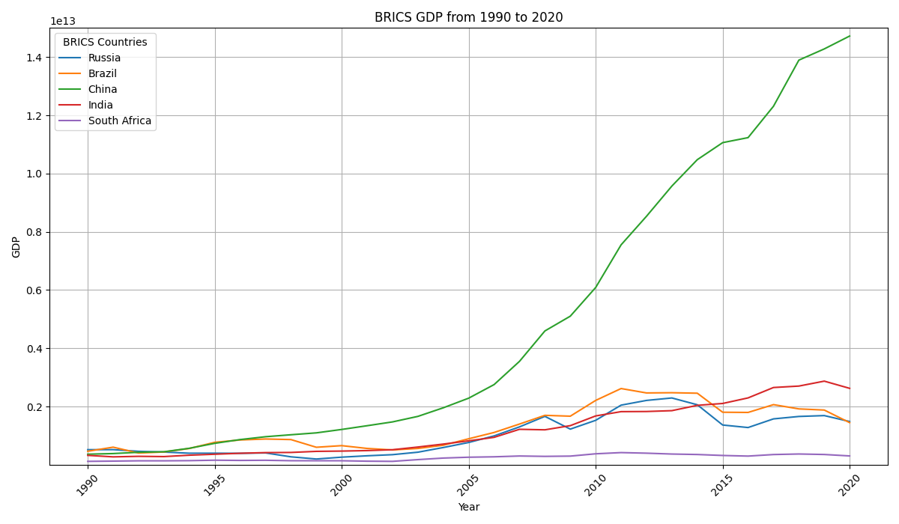
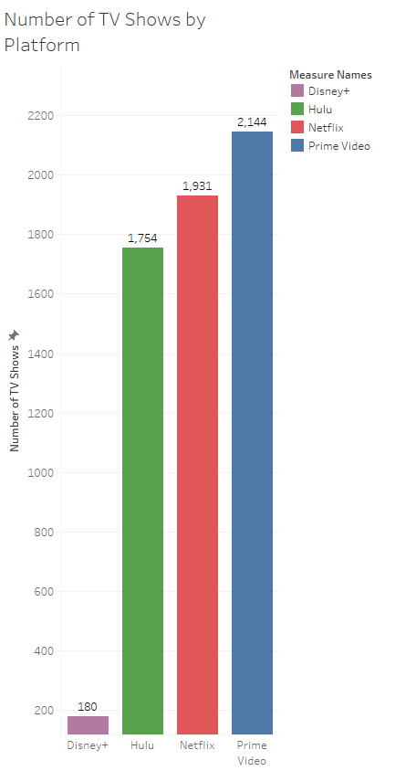

# HW 3 - CS625, Spring 2025

John Cartwright
Due: February 23, 2025

## Overview

The three visualizations I chose (bar chart, scatterplot, multiple line chart) were created using Pythons Matplotlib and Seaborn libraries. For the fourth visualization I remade the bar chart using Tableau. All images, workbooks, scripts, and relevant output files are included in the repo. As an additional note: the dataset files I used were downloaded and referenced locally by my scripts, and I have included them in the repo. To successfully run the scripts as-is, all that is necessary is to clone the repo and run the scripts thus via CLI:

```
python3 <script name>
```

## Bar Chart 

For the first visualization, I utilized the TV Shows dataset from the following link: https://github.com/MainakRepositor/Datasets/blob/master/TV_Shows.csv

The relevant data I analyzed within the dataset was the number of TV shows for a given digital platform. I thought a bar chart was a good medium for this data, as it is ideal for displaying basic quantitative data with categorical variables. 

Idiom: Bar Chart / Mark: Line
| Data: Attribute | Data: Attribute Type  | Encode: Channel | 
| --- |---| --- |
| Providers | key, categorical | horizontal position on a common scale (x-axis) |
| Number of TV Shows | value, quantitative | vertical spatial region (y-axis) |

The Python script, tv\_shows.py, takes our csv in as a Pandas dataframe. The relevant columns (Netflix, Hulu, Prime Video, Hulu) have a value of either 1 or 0 for a given row; 1 if the TV Show is present on the platform, 0 if not. We simply need to perform a summation operation for the platform columns and assign the column names to a list. Then the chart itself is created. No data cleaning, editing etc. is necessary. Here is what our [bar chart script](tv_shows.py) looks like:

```
#TV Shows
import pandas as pd
import matplotlib.pyplot as plt
import seaborn as sns

# Load the CSV file into a pandas DataFrame
df = pd.read_csv("TV_Shows.csv")

 
# Count the number of TV shows for each provider
provider_counts = df['Netflix'].value_counts().get(1, 0), df['Hulu'].value_counts().get(1, 0), df['Prime Video'].value_counts().get(1, 0), df['Disney+'].value_counts().get(1, 0)
providers = ['Netflix', 'Hulu', 'Prime Video', 'Disney+']

 
# Create a bar chart to visualize the comparison
plt.figure(figsize=(10, 6))
plt.bar(providers, provider_counts, width=0.5, color=['red', 'green', 'blue', 'purple'])
plt.xlabel('Providers')
plt.ylabel('Number of TV Shows')
plt.title('Number of TV Shows by Platform')
plt.show()
```

When the script is run, it produces the following:



The chart is strongly separated by color and space between the bars, leaving little room for confusion and clutter. While quantity may not be reflective of quantity, I found this chart to be potentially helpful for someone who may be on the fence with digital subscriptions and wanting and idea of their catalog options.

## Scatterplot

The next visualization I utilized was a scatterplot that correlated house prices in the state of Washington against living square footage (distinct from lot footage). The dataset used for the scatterplot is here: https://github.com/MainakRepositor/Datasets/blob/master/house%20price.csv

A scatterplot for this type of comparison was appropriate, as it is a comparison of two variables to determine a correlation (or lack thereof).

Idiom: Scatterplot / Mark: Point
| Data: Attribute | Data: Attribute Type  | Encode: Channel | 
| --- |---| --- |
| House Prices | value, quantitative | horizontal position on a common scale (x-axis) |
| Living Square Footage | value, quantitative | vertical spatial region (y-axis) |

The script is simple, as we can immediately create our scatterplot and compare price and sqft\_living columns. Though no cleaning nor limiting to subset data was utilized, I did employ bounds to the x and y limits. This eliminated some outliers but also reigned in the focus size to provide greater detail to the vis itself. The [scatterplot script](house_prices_sqft.py) is as follows:

```
import pandas as pd
import matplotlib.pyplot as plt

# Load CSV data into a DataFrame
df = pd.read_csv("house price.csv")

# Create the scatterplot
plt.figure(figsize=(10, 6))
plt.scatter(df['price'], df['sqft_living'], alpha=0.45, color='green')

# Scatterplot Labels
plt.title('Price by Living Square Footage in Washington State')
plt.xlabel('House Price')
plt.ylabel('Square Footage')

# Rotate xlabels for better readability
plt.xticks(rotation=45)

# Bound x and y values to exclude deadspace/extreme outliers
plt.xlim(100000, 1000000)
plt.ylim(0, 8000)

# Enforce grid, not necessary but optional for looks
# plt.grid(True)

# Tight layour for padding
plt.tight_layout()

# Display plot
plt.show()
```

After running the above script, we get the following:



Originally, the scatterplot used black but after testing various color choices, I settled on green. While the alpha value provides some transparency, and thus better insight into clusters, the color choice enhanced my ability to better analyze the vis. I also upped the size for this vis and removed scientific notation for the x values, as they are less valuable to the reader. As far as the information conveyed, we can see a generally positive correlation between square footage and house price.

## Multiple Line Chart

For the third visualization, I used a multiple line chart comparing the GDPs of select countries, linked here: https://github.com/MainakRepositor/Datasets/blob/master/GDP.csv

Specifically, I wanted to compare the GDPs of the "BRICS" countries; Brazil, Russia, India, China, and South Africa. Over the years, the term has become popular in geopolitical and economic contexts. While the dataset contains every country and their respective GDPs from 1960 to 2020, I am filtering data down to just the five BRICS countries. This is done for the sake of our topic but also to reign in the number of countries analyzed, as the chart could easily be cluttered. After several test iterations, I also decided to filter the data down to just 1990-2020, as it better captures changes vs. the full sixty years. Finally, the script also sets high and low limits to the the GDP variable so as to eliminate unnecessary dead space.

I felt this dataset was ideal for a multiple line chart, as it allowed for the addition of data (countries) discernable from merely the y or x axes. This addition of a "third dimension" made the multiple line chart the best fit. 

Idiom: Multiple Line Chart / Mark: Line
| Data: Attribute | Data: Attribute Type  | Encode: Channel | 
| --- |---| --- |
| Country | key, categorical | Color |
| Year | key, ordinal | horizontal position on a common scale (x-axis) |
| GDP | value, quantitative | vertical spatial region (y-axis) |

Our [multiple line chart script](gdp.py)

```
import pandas as pd
import seaborn as sns
import matplotlib.pyplot as plt

df = pd.read_csv("GDP.csv")

# Select the countries of interest
countries_of_interest = ['Brazil', 'Russia', 'India', 'China', 'South Africa']
filtered_df = df[df['country'].isin(countries_of_interest)]

# Conver years to integer and exlude all years before 1990
filtered_df['year'] = filtered_df['year'].astype(int)
filtered_df = filtered_df[filtered_df['year'] >= 1990]

# Create the multiple line chart using Seaborn
plt.figure(figsize=(12, 7))
sns.lineplot(data=filtered_df, x='year', y='gdp', hue='country')

# Plot labels and legend
plt.title('BRICS GDP from 1990 to 2020')
plt.xlabel('Year')
plt.ylabel('GDP')
plt.legend(title='BRICS Countries')

# Bounding GDP amount limits
plt.ylim(20000000, 15000000000000)
plt.xticks(rotation=45)

# Enforce grid and tight layout
plt.grid(True)
plt.tight_layout()

# Display the plot
plt.show()
```

And our output graphic:



The first thing to pop to the viewer is the colors of our various countries, identified by the legend in the top left corner. It shows the change of GDP of the BRICS countries over a horizontal plane of time, with the changes in the line being dictated by growth/shrinking of the GDP. This makes it perfectly logical and discernible to the viewer. The scientific notation remains on the left hand side, but is easily translatable to the represented amounts (i.e. 1.4 = 14 trillion). Overall the multiple line chart looks great and shows how of all the BRICS country, China experienced the greatest growth and was the only BRICS member seemingly unaffected GDP-wise by the end of 2020.

## Tableau Bar Chart

For my recreated vis, I opted to utilize Tableau to create my TV show bar chart:



My workbook for the above chart: [Workbook](BarChartWorkbook.twb)

## Reflection

While Tableau is easy in the sense that there is no coding involved, I felt much more comfortable with Python. I chalk this up to being more experienced with Python, and feel that it's simply intuitive to write code telling Seaborn, Matplotlib, etc. what to do, test, debug, repeat. However I can understand the appeal of Tableau and why it is so prevalent in the business world. After some blind fumbling and looking up references, I was able to make my bar chart roughly equivalent to the Python version, and it looks arguably better.

## References

https://matplotlib.org/stable/api/_as_gen/matplotlib.pyplot.scatter.html

https://matplotlib.org/stable/api/_as_gen/matplotlib.pyplot.bar.html

https://community.tableau.com/s/question/0D58b0000BU3TxMCQV/changing-colors-for-individual-bars

https://seaborn.pydata.org/generated/seaborn.lineplot.html
