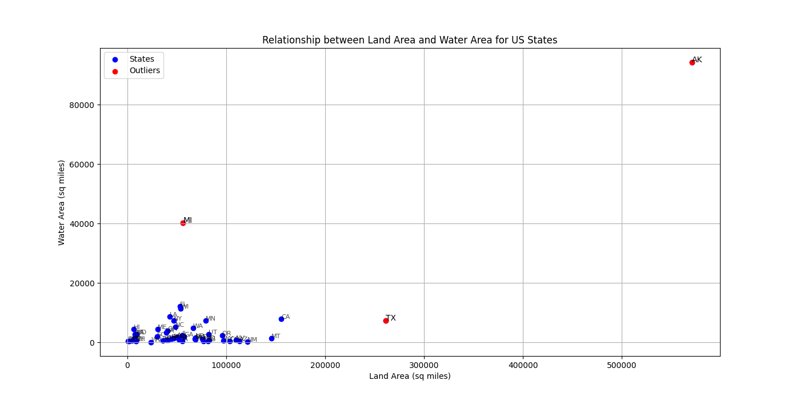
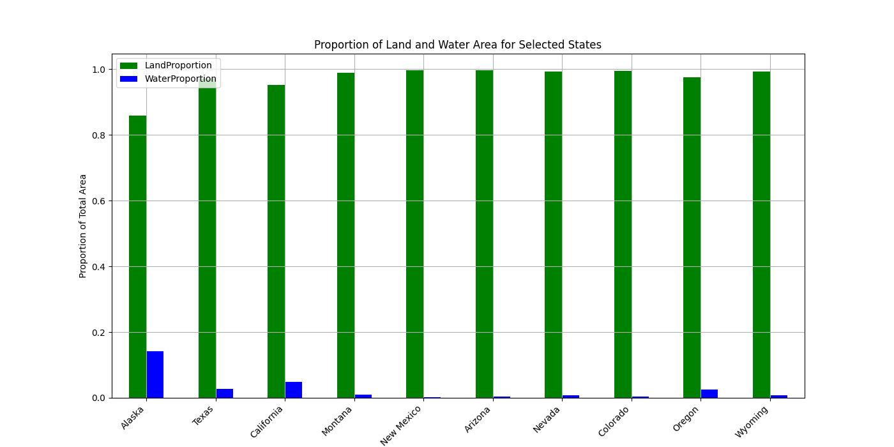

# HW 4 - CS625, Spring 2025

John Cartwright
Due: March 16, 2025

## Overview

In this report we will be examing Dataset 1, Table 346 - Land and Water Area Of States and Other Entities: 2008, linked here: https://www2.census.gov/library/publications/2010/compendia/statab/129ed/tables/10s0346.xls

All images, workbooks, and relevant output files are included in this repo. In order to execute any of the scripts from the command line, one simply needs to enter the following:

```
python3 states_area.py
```

### Preparation

Before working on the script, I manually edited the dataset using Microsoft Excel, as the dataset itself was an Excel file. As such, there was little in the way of uniformity and there are several column titles, some spanning multiple columns, before even touching the data in question. I simply removed all but the relevant column titles, and reserved said titles for just the first row. The edited file can be found here in the repo: [Dataset Excel](dataset_1.xls)

Before addressing our dataset's relevant questions, it was necessary to further prepare the data using Python:

```
# Load the Excel file
url1 = 'dataset_1.xls'
df = pd.read_excel(url1, na_values=['NaN'])

#print(df.columns)
df['States'] = df['States'].astype(str)
df['States'] = df['States'].str.strip()
column_states = df['States']
column_states_new = [x for x in column_states if x!='nan' and x!='*']

column_abbrev = df['PO Abbreviation'].dropna()
column_abbrev_new = [x for x in column_abbrev if x!='nan' and x!='*']
#print(column_abbrev_new)

# Getting rid of commas in numerical values
df['Total Square Mile '] = df['Total Square Mile '].replace(',', '', regex=True)
df['Land Square Mile '] = df['Land Square Mile '].replace(',', '', regex=True)
df['Water Square Mile '] = df['Water Square Mile '].replace(',', '', regex=True)

# Convert to string to parse out NaN values
df['Total Square Mile '] = df['Total Square Mile '].astype(str)
df['Land Square Mile '] = df['Land Square Mile '].astype(str)
df['Water Square Mile '] = df['Water Square Mile '].astype(str)

# Create new lists after parsing out NaN values
column_total = df['Total Square Mile ']
column_land = df['Land Square Mile ']
column_water = df['Water Square Mile ']
column_total_new = [x for x in column_total if x!='nan']
column_land_new = [x for x in column_land if x!='nan']
column_water_new = [x for x in column_water if x!='nan']

# Create new dataframe with cleaned, relevant columns
updated_df = pd.DataFrame({'State': column_states_new, 'Abbreviation': column_abbrev_new, 'TotalArea': column_total_new, 'LandArea': column_land_new, 'WaterArea' : column_water_new})

# Convert column values to float type
updated_df['TotalArea'] = updated_df['TotalArea'].astype(float)
updated_df['LandArea'] = updated_df['LandArea'].astype(float)
updated_df['WaterArea'] = updated_df['WaterArea'].astype(float)
```

After loading the excel, we stripped all whitespace from the States column, assigned the column to a list, and then created a new list minus any 'NaN' values or the '*' present in the column. We go ahead and do the same for PO Abbreviation, as this will be helpful in labeling our vis. The Total Square Mile, Land Square Mile, and Water Square Mile columns then have their commas removed and are converted to strings. 

The process we had for States and PO Abbreviation is repeated, and all "junk" values are removed from the columns while adding legitimate entries to a new list. A new dataframe, updated\_df is created using these lists, and our 'Area' columns are converted to float types. 

### Q1 - Show rRlationship Between States' Land and Water Areas: 

```
# Q1: Show the relationship between land area and water area
plt.figure(figsize=(14, 7))
plt.scatter(updated_df['LandArea'], updated_df['WaterArea'], color='blue', label='States')

# Highlight interesting outliers
outliers = updated_df[(updated_df['WaterArea'] > 20000) | (updated_df['LandArea'] > 200000)]
plt.scatter(outliers['LandArea'], outliers['WaterArea'], color='red', label='Outliers')

for i, state in outliers.iterrows():
  plt.text(state['LandArea'], state['WaterArea'], state['Abbreviation'])
  
# Annotate non-outlier blue points
non_outliers = updated_df[~updated_df.index.isin(outliers.index)]
for i, state in non_outliers.iterrows():
    plt.text(state['LandArea'], state['WaterArea'], state['Abbreviation'], fontsize=8, alpha=0.7)

# Label and show plot
plt.xlabel('Land Area (sq miles)')
plt.ylabel('Water Area (sq miles)')
plt.title('Relationship between Land Area and Water Area for US States')
plt.legend()
plt.grid(True)
plt.show()
```

For the first question, I chose to utilize a scatterplot as our idiom. Scatterplots are ideal when comparing quantitative variables belonging to a categorical "value holder" (in our case, U.S. states). I chose to define the outliers as states with a water area greater than 20,000 square miles and/or land area greater than 200,000 square miles. The outlier datapoints stand out with a red value while our other values are blue. The points are labeled using their two-letter state abbreviations.

Idiom: Scatterplot / Mark: Point
| Data: Attribute | Data: Attribute Type  | Encode: Channel | 
| --- |---| --- |
| States | key, categorical | color |
| Land Area (Sq. Miles) | value, quantitative | horizontal position on a common scale (x-axis) |
| Water Area (Sq. Miles) | value, quantitative | vertical spatial region (y-axis) |



Our three outliers are immediately visible: Alaska, Texas, and Michigan. Alaska is our farthest outlier based on both land and water area, being the largest U.S. state by a great magnitude, and Texas is a distant second. Texas has a similar water area to the big cluster of states, but a greater land area. Most interestingly, Michigan is an outlier based purely on it's water area. This can most likely be explained by the Great Lakes, which surround Michigan.

### Q2 - Pick 10 States and Compare Proportion of Land and Water Areas

For the second question, I opted to choose the 10 states with the largest total areas:

```
# Q2: Compare the proportion of total area that is land and water for 10 states
# Choosing 10 states with the largest total area
selected_states = updated_df.nlargest(10, 'TotalArea')
selected_states['LandProportion'] = selected_states['LandArea'] / selected_states['TotalArea']
selected_states['WaterProportion'] = selected_states['WaterArea'] / selected_states['TotalArea']

# Plotting the comparison
selected_states.plot(x='State', y=['LandProportion', 'WaterProportion'], kind='bar', figsize=(14, 7))
plt.xlabel('State')
plt.ylabel('Proportion of Total Area')
plt.title('Proportion of Land and Water Area for Selected States')
plt.grid(True)

plt.show()

# Print the selected states and their proportions
print(selected_states[['State', 'LandProportion', 'WaterProportion']])
```

The above snippet finds our 10 largest by total area states using the nlargest function, and assigns them to selected\_states. The new columns 'LandProportion' and 'WaterProportion' are added with appropriate values for each state. The chart is then created; in this case I opted to utilize a grouped bar chart. The types data I want to compare, land proportion and water proportion, are shared by all 10 states. Thus a grouped bar chart makse sense, as I can group the comparisons side-by-side, for each state, and still show the viewer their respective, quantitative proportions.

Idiom: Bar Chart / Mark: Line
| Data: Attribute | Data: Attribute Type  | Encode: Channel | 
| --- |---| --- |
| State | key, categorical | horizontal position on a common scale (x-axis) |
| Land Proportion | value, quantitative | color, vertical spatial region (y-axis) |
| Water Proportion | value, quantitative | color, vertical spatial region (y-axis) |



As a note, the y-axis is measuring on a 0.0 to 1.0, representative of the percentage of land and water area per state; 0.0 being 0%, while 1.0 is 100%. The chart shows our 10 largest states, from left to right, with land and water proportions side-by-side for each. I chose green for land and blue for water, to better assist the viewer in differentiating between the two. Green is typically associated as a land color while blue is associated with water, so I felt the choice was fitting. The script also produces the proportions between the 10 largest states, which is a helpful companion to the vis:

```
         State  LandProportion  WaterProportion
1       Alaska        0.858158         0.141842
42       Texas        0.972558         0.027443
4   California        0.951568         0.048432
25     Montana        0.989812         0.010188
30  New Mexico        0.997589         0.002410
2      Arizona        0.996531         0.003474
27      Nevada        0.992835         0.007163
5     Colorado        0.995645         0.004361
36      Oregon        0.975668         0.024335
49     Wyoming        0.992593         0.007402
```

While Alaska has a more generous water proportion, (~86% vs ~14%), the other 9 states have much greater proportions of land.

## Reflection

Overall I felt the created visualizations were helpful in highlighting some known facts about U.S. state sizes, while also shedding light on otherwise lesser known info. For instance, the water proportion of Michigan or the close to 100% land dominance most states have. 

A question I had, that naturally extends from Q2, is the land-water proportion of all 50 states. I believe that land would be around 95% or greater in the majority of U.S. states, but a grouped bar chart would not be ideal. Firstly, the use of 2 separate bars for each state takes up space, while the horizontal extension needed limits its convenient viewing on a screen. I would use a horizontal, stacked bar chart for the analysis of all 50 states' land-water proportions. That way, only one bar per state is needed and the chart is better viewed on screens, as the chart extends vertically.

Another question I thought of was that of the different types of water areas of each state. Though it is unexplored by the questions, the dataset includes inland, coastal, Great Lakes, and territorial square mileage. A horizontal stacked bar chart would also be a good option for this question, but a grouped bar chart for the top 10 states (by water area) would also be interesting. I believe Alaska would be included in such a list, as well as Michigan, with the other 8 being coastal states.

## References

https://www.freecodecamp.org/news/how-to-change-color-in-matplotlib/

https://matplotlib.org/stable/api/_as_gen/matplotlib.pyplot.scatter.html

https://matplotlib.org/stable/api/_as_gen/matplotlib.pyplot.bar.html

https://stackoverflow.com/questions/65981684/annotating-scatterplot-points-with-df-column-text-matplotlib
