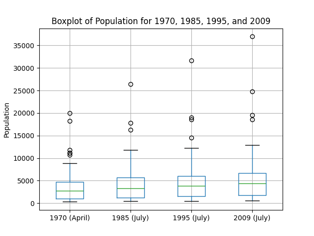
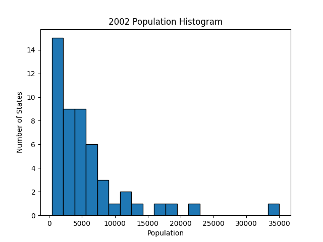
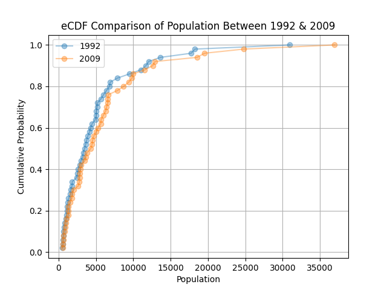
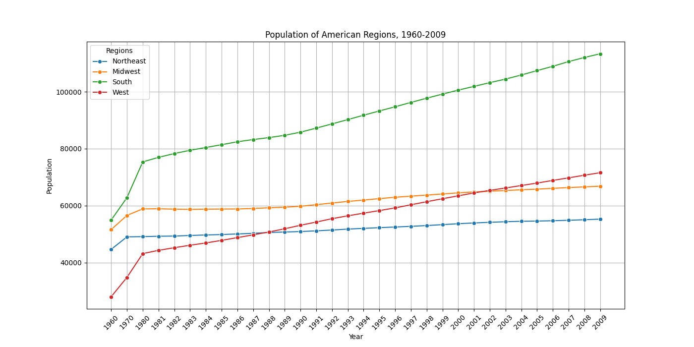

# HW 5 - CS625, Spring 2025

John Cartwright

Due: March 23, 2025

## Overview

In this report we will be examing Table 12 - Resident Population--States, linked here: https://www2.census.gov/library/publications/2010/compendia/statab/130ed/tables/11s0012.xls

All images, workbooks, and relevant output files are included in this repo. In order to execute any of the scripts from the command line, one simply needs to enter the following:

```
python3 states_population.py
```

### Preparation

Before working on the script to create our charts, I manually edited the dataset using Microsoft Excel, as the dataset itself was an Excel file. As such, there was little in the way of uniformity and there are several column titles, some spanning multiple columns, before even touching the data in question. I simply removed all but the relevant column titles, and reserved said titles for just the first row. The edited file can be found here in the repo: [Dataset Excel](dataset_1.xls)

Before addressing our dataset's relevant questions, it was necessary to further prepare the data using Python:

```
# Load the Excel file
xls = 'dataset_1.xls'
df = pd.read_excel(xls, na_values=['NaN'])

#print(df.columns)

# Drop regional entries from State column
regions = df[((df.State == 'Northeast') | (df.State == 'Midwest') | (df.State == 'South') | (df.State == 'West '))].index
df.drop(regions, inplace=True)

df = df.replace(',', '', regex=True)
```

After loading the excel, we start by printing the columns (now commented out), to ensure our manual edits in Excel resulted in the correct columns. I then opted to drop the regional values in the 'State' column, as they would skew our strictly state-based analysis. We also replace any comma in the dataframe with nothing via the replace() function, in order to avoid reading in any numerical values as strings.

### Task 1 - Create boxplots showing population distributions: 

```
# Task 1: Create boxplots for 1970, 1985, 1995, and 2009
df.boxplot(column=['1970 (April)', '1985 (July)', '1995 (July)', '2009 (July)'])

# Display plot
plt.title('Boxplot of Population for 1970, 1985, 1995, and 2009')
plt.ylabel('Population')
plt.show()
```

Our first task is relatively simple; we need only to define a dataframe boxplot based on the given year columns. We then display the chart, which can be seen after executing the script:



As we can see in the graph, the overall growth of the state populations in the interquartile range and whiskers lightly increased. Our outlier values (circles on the chart) had greater levels of growth than the rest of the dataset.

### Task 2 - Histogram of state populations in 2002

For the second task, I created a histogram showing state populations in the year 2002

```
# Task 2: Create histogram for state populations in the year 2002
# Assign 2002 column to list
pop_values = df['2002 (July)']

# Define bin numbers
bin_num = 20

# Create bin ranges
bins = np.linspace(400, 35000, bin_num + 1)

# Create histogram
plt.hist(pop_values, bins=bins, edgecolor='black')
plt.xlabel('Population')
plt.ylabel('Number of States')
plt.title('2002 Population Histogram')
plt.show()
```

The above snippet begins by assigning our chosen column to pop\_values. We then assign a desired number of bins and using numpy's linspace() function, we define our bins based on a minimum value of 400 and maximum vaue of 35000. The histogram is the created based on our list and defined bins:



When manually observing the chart and adding up the values, we can see all 50 states are represented. The general trend is that of decreasing values; the greatest share of states per bin, 15, is somewhere in the range of 1000-1500. From there the number of states per bin decreases, with a few outliers going to the latter bins.

### Task 3 - eCDF Comparison Between 1992 and 2009

In the final task, I wanted to create an eCDF comparison between 1992 and 2009. I felt that the two years were far enough apart to graphically see a difference. The following snippet addresses the third task:

```
# Task 3: Population distributions in 1992 and 2009
# Create lists from year columns
year_1992 = df['1992 (July)']
year_2009 = df['2009 (July)']

# Create np arrays
year_1 = np.array(year_1992)
year_2 = np.array(year_2009)

# Sort the data
sorted_year_1 = np.sort(year_1)
sorted_year_2 = np.sort(year_2)

# Compute eCDF values
cdf_year_1 = np.arange(1, len(sorted_year_1) + 1) / len(sorted_year_1)
cdf_year_2 = np.arange(1, len(sorted_year_2) + 1) / len(sorted_year_2)

# Plot the eCDFs
plt.plot(sorted_year_1, cdf_year_1, marker='o', label='1992', linestyle='-', alpha=0.4)
plt.plot(sorted_year_2, cdf_year_2, marker='o', label='2009', linestyle='-', alpha=0.4)
plt.xlabel('Population')
plt.ylabel('Cumulative Probability')
plt.title('eCDF Comparison of Population Between 1992 & 2009')
plt.legend()
plt.grid(True)
plt.show()
```

We first define our two years based on their respective column names. We then create two arrays based on these columns and proceed to sort them. We then create our CDF values using the NumPY arrange() function. The graph itself is then define. Both years utilize points and connected line marks but are differentiated by color (blue and orange). I also added transparency to the values, as without it, the 1992 values are less visible due to 2009 overlapping it:



As can be seen on our chart, both years trend very similarly. We can see the difference in population however, as 2009's distribution sits more to the right on the x-axis. Our outlier data points, those reaching closer to a 1.0 probability of falling below the average value, sit farther along the right of the x-axis in the 2009 year group.

### Additional Analysis

For additional analysis, I wanted to look at the differences between the various regions, as they were not analyzed in the other tasks. I created a new script, additional\_analysis.py that can be executed identitically to the previous script.

```
# Load the Excel file
xls = 'dataset_1.xls'
df = pd.read_excel(xls, na_values=['NaN'])

# Additional analysis
# Comparing growth of American regions

# Filter rows for American regions
comparison_regions = ['Northeast', 'Midwest', 'South', 'West']
df['State'] = df['State'].astype(str).str.strip()

selected_states = df[df['State'].isin(comparison_regions)]
selected_states = selected_states.drop(columns=['Post office abbreviation', '2-digit ANSI code', '1990 (April) Census', '1990 (April) \\2 Estimates base', '2000 (April) Census', '2000 (April) \\3 Estimates base'])

# Ensure column names (years) are strings before transposing
selected_states.columns = selected_states.columns.astype(str)

# Reshape data using melt and clean
long_df = pd.melt(selected_states, id_vars=['State'], var_name='Year', value_name='Population')
long_df['Year'] = long_df['Year'].astype(str)
long_df['Population'] = pd.to_numeric(long_df['Population'], errors='coerce') 
long_df = long_df.dropna(subset=['Population'])

plt.figure(figsize=(14,7))
sns.lineplot(data=long_df, x='Year', y='Population', hue='State', marker='o')

# Add labels, title, and legend
plt.xlabel('Year')
plt.ylabel('Population')
plt.title('Population of American Regions, 1960-2009')

# Shorten x-tick labels to the first 4 characters
original_xticks = plt.gca().get_xticklabels()  
shortened_labels = [label.get_text()[:4] for label in original_xticks]  
plt.xticks(ticks=plt.gca().get_xticks(), labels=shortened_labels)
plt.xticks(rotation=45) 

# Grid and Legend
plt.grid(True)
plt.legend(title='Regions')

# Display the chart
plt.show()
```

In our script we again read in the dataset and proceed to make a number of changes. First we create a list comprised of the American regions in our dataset and the 'State' column in our dataframe is stripped and values affirmed as strings. We then trim our dataframe to just the rows identical to the named values in the list, and several columns are dropped; the PO abbreviation and ANSI codes due to irrelevance, as well as duplicate year census entries.

We then make use of the melt function. The appropriate values are affirmed as their respective types (string, numeric) and NaN entries dropped. We then define our lineplot. The lineplot is additionally refined by shortening our x-ticks to just the first 4 characters, as the original column entries are verbose and would not be visible in the final product otherwise. Our script produces the following graph:



Based on the line chart, the southern United States maintains the lead for all given years. The Midwest and Northeast experience slight, steady growth. Most interestingly, the West started in 1960 with the lowest population but by 2003, had overtaken the Midwest as the second most populous region and continued to grow from there.

## References

* https://www.geeksforgeeks.org/string-slicing-in-python/
* https://matplotlib.org/stable/api/_as_gen/matplotlib.pyplot.hist.html
* https://numpy.org/doc/stable/reference/generated/numpy.linspace.html
* https://pandas.pydata.org/pandas-docs/stable/reference/api/pandas.DataFrame.boxplot.html
* https://seaborn.pydata.org/generated/seaborn.lineplot.html
* https://www.simon-neutert.de/2018/plot-ecdf/
* https://stackoverflow.com/questions/11244514/modify-tick-label-text
