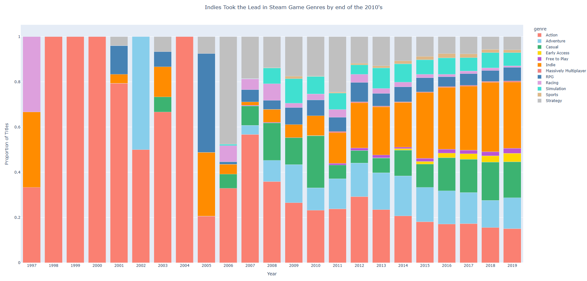
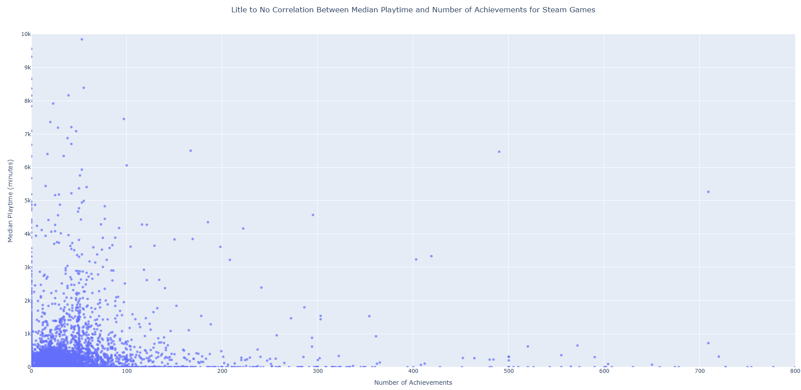
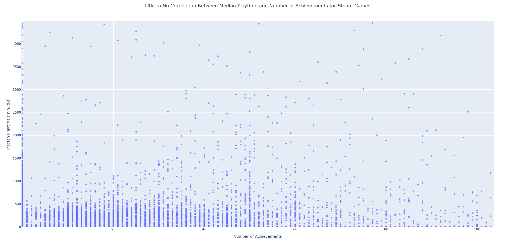

# Course Project - CS625, Spring 2025

John Cartwright

Due: April 20, 2025

## Steam Game Store Data Project
### About the Dataset

For my project, I wanted to analyze trends on Steam, a popular PC gaming platform. Steam was launched as a software client for developer Valve's games, also the creators of Steam. The platform transitioned to distributing third-party titles in 2005. The dataset I utilized for my project was Nik Davis' Steam Store Games found on Kaggle: https://www.kaggle.com/datasets/nikdavis/steam-store-games 

The dataset covers information from 27,000 games scraped via the Steam and SteamSpy APIs, up to 2019. While there were more recent, bigger datasets available, they were not as clean and had many missing entries, hence why I decided on Davis' dataset. As Nik states on the Kaggle page "...it contains most games on the store released prior to that date. Unreleased titles were removed as well as many non-games like software, though some may have slipped through." Indeed, some "non-game" entries did slip through, marginal as they were, and are addressed in question 1. There was no cleaning of the given dataset necessary for this project.

### How to Run

In order to run the provided [script](steam_project.py), the user will need a couple of Python libraries installed, namely pandas and plotly. To install from the command line, enter the following:

```
pip3 install pandas plotly
```

After the required dependencies have been installed, the script can be run from the command line using the following command: 

```
python3 steam_project.py
```

Images of the charts have been provided in the repo, but in order to actually utilize the interactive charts, the end user must run the script and have an up to date, WebGL-capable browser.

### Preparation

Before addressing our dataset's relevant questions, there was some minor pre-processing needed in our Python script:

```
# Load dataset
df = pd.read_csv('steam.csv')
df.columns = df.columns.str.strip()

# Pre-Processing
df['release_year'] = pd.to_datetime(df['release_date'], errors='coerce').dt.year
df = df.dropna(subset=['release_year'])
df['release_year'] = df['release_year'].astype(int)
```

After loading the CSV, we strip our columns of any extra whitespace. To prep for question 1, we create the release\_year column by enforcing the release\_date column as datetime and extracting the year from it. Any NaN values are dropped and our year values are enforced as integer types.

### Question 1 - How have genre types trended on Steam over time?

Idiom: Stacked Bar Chart / Mark: Line
| Data: Attribute | Data: Attribute Type  | Encode: Channel | 
| --- |---| --- |
| Genre Types | key, categorical | color |
| Genre Counts | value, quantitative | vertical spatial region (y-axis) |
| Years | value, ordinal | horizontal position on a common scale (x-axis) |

In our first question, we are concerned with two columns in particular: genres and release\_date. As seen in the pre-processing, we have already extracted our release years and created a column for them. Before we can create our chart, we must take a few steps with the genres column:

```
# Stacked Bar Chart
# Split genres into multiple rows
df['genres_split'] = df['genres'].str.split(';')
df['genre_count'] = df['genres_split'].apply(len)
df_exploded = df.explode('genres_split')
df_exploded['genres_split'] = df_exploded['genres_split'].str.strip()

# Genres to exclude
excluded_genres = {'Violent', 'Gore', 'Nudity', 'Sexual Content', 'Documentary', 'Accounting',
                   'Animation & Modeling', 'Video Production', 'Utilities', 'Web Publishing',
                   'Game Development', 'Design & Illustration', 'Photo Editing', 'Audio Production',
                   'Software Training', 'Tutorial', 'Education'}

# Filter unwanted genres
df_filtered = df_exploded[~df_exploded['genres_split'].isin(excluded_genres)].copy()

# Recalculate fraction to ensure proper weighting after exclusion
df_filtered['fraction'] = 1 / df_filtered.groupby(df_filtered.index)['genre_count'].transform('sum')

# Compute fractional counts
genre_fractional_counts = (
    df_filtered.groupby(['release_year', 'genres_split'])['fraction'].sum().reset_index(name='count')
)

# Normalize data to get proportions (i.e. each year sums to 1.0 i.e. 100%)
pivot_frac = genre_fractional_counts.pivot(index='release_year', columns='genres_split', values='count').fillna(0)
pivot_frac_normalized = pivot_frac.div(pivot_frac.sum(axis=1), axis=0)  # Normalize rows to sum to 1 (proportions)

 
# Convert pivot table to long format for Plotly
pivot_frac_long = pivot_frac_normalized.reset_index().melt(id_vars='release_year',
                                                           var_name='genre', value_name='proportion')
```

First we split our genres into a 'split' column, removing the semicolon delimiter for entries with multiple genres. We then create the 'genre\_count' column, which is based on the length of the values in our 'genres\_split' column. We then use the explode function centered on our 'genres_split' column, which will create a row for each genre of each given title entry. The whitespace is then stripped.

In order to get an accurate accounting of genre trends, we will use fractional values to account for games with multiple genres. We then create a 'fraction' column in our new exploded dataframe by dividing 1 by the 'genre\_count' values (i.e. a game with four genres would result in 1/4 for each genre). 'genre\_fractional\_counts' is created by grouping release year and 'genres\_split' together with the 'fraction' column we created, and performing a summation of values. 

Next, after successful tests of the original graph, I decided to create a list of genres to exclude from our analysis. This was done due to them not being genres but rather features (i.e. gore, violent), or simply not falling under a typical game genre (i.e. accounting, documentary). Next we filter these values from our exploded dataframe and assign them to a new, filtered dataframe. The fractional counts are then re-calculated. We then create our final dataframe, pivot\_frac, using the pivot function centered on release year as the index and our genre split as the columns, with their summation counts as the values. 

Now we can create our first plotly chart:

```
# Plot the normalized stacked bar chart using Plotly
fig_bar = px.bar(pivot_frac_long, x='release_year', y='proportion', color='genre',
                 title='Indies Take the Lead in Steam Game Genres, 1997-2019',
                 color_discrete_sequence=['salmon', 'skyblue', 'mediumseagreen', 'gold', 
                         'mediumorchid', 'darkorange', 'lightcoral', 'steelblue', 
                         'plum', 'turquoise', 'burlywood', 'silver', 'dimgray'],
                 labels={'release_year': 'Year', 'proportion': 'Proportion of Titles'},
                 barmode='stack')

# Show all x-axis ticks, center title
fig_bar.update_layout(
    xaxis=dict(tickmode='linear'),
    title=dict(
        text='Indies Take the Lead in Steam Game Genres, 1997-2019',
        x=0.5,
        xanchor='center'
    )
)

fig_bar.show()
```

Now we have created our plotly chart with the given dimensions. Our x and y axes are defined and our color palette is defined (plotly uses CSS values for colors). We then set our labels and update the layout to ensure are x-ticks are accounted for and our title is centered. After running the script, we get our stackd bar chart:



As we can see from the chart, the Action genre is dominant until the mid-2000's, when Steam began to take off as a third-party PC sales platform. We see not only a growth in the diversity of genres, but a proportional shrinking of titles released under certain genre titles, such as Action and Strategy. By 2019, when the dataset ends, Indies made up about 30% of reported game genres. Action, Casual, and Adventure each account for 13-15% of the game genres on Steam, while the other genres account for single-digit or less percentages.

### Question 2 - Is there a correlation between higher median play time and number of in-game achievements?

Question two concerns to quantitative values, so the best idiom to utilize will be a scatterplot:

Idiom: Scatterplot / Mark: Point
| Data: Attribute | Data: Attribute Type  | Encode: Channel | 
| --- |---| --- |
| Median Play Time (minutes) | value, quantitative | vertical spatial region (y-axis) |
| In-Game Achievements | value, quantitative | horizontal position on a common scale (x-axis) | 

And here is our implementation in the script:

```
# Scatterplot
fig_scatter = px.scatter(df, x='achievements', y='median_playtime',
                         title='Little to No Correlation Between Median Playtime and Number of Achievements for Steam Games',
                         labels={'achievements': 'Number of Achievements',
                                 'median_playtime': 'Median Playtime (minutes)'},
                         opacity=0.7)

# Set x and y limits, center title
fig_scatter.update_layout(xaxis=dict(range=[0, 800]),
                          yaxis=dict(range=[0, 10000]),
                          title=dict(
                            x=0.5,
                            xanchor='center'
                          )
    )

fig_scatter.show()
```

Aside from the basic prep in pre-processing, there is no additional preparation necessary and we can create our scatterplot right away. 



Most of our points are clustering in the lower left-hand corner, meaning most of our Steam entries tend towards lower median minutes played and/or lower numbers of achievements. Using the plotly charts zoom function, we can hone in on the clustered region:



We can see that most entries have somewhere between 0 and 50 achievements, and the number of points taper off the further they move past 50. Aside from this observation, it is hard to discern any strong pattern. This leads us to conclude that the number of achievements alone has little if any affect on the play time invested into games on Steam. If anything, most games tend to stick to 50 or less achievements, perhaps due to the extra effort to think of more or to have a more manageable number.

### Final Thoughts

For question 1, there was a lot of trial and error, particularly with regards to the appropriate way to measure multiple genres and which genres to include/exclude. I felt that the dataset was lacking in the actual number of unique genre titles. My original hypothesis was that more 'traditional' genres would decline in release while genres such as free-to-play, multiplayer, etc. would trend higher through the years. This hypothesis was largely accurate, with traditional genres declining in overall release percentages while newer, sometimes more niche genres, began to take space. Another aspect that took a lot of time, that I originally didn't think would, was choosing the color palette. The default palettes provided by plotly were either too sharp in their appearance and/or did not support the number of genres in the dataframe. 

The implementation to answer question 2 was rather cut and dry, but the results themselves were surprising; my original hypothesis was that there was some level of correlation between a higher number of achievements and median playtime. Based on the chart, there is no strong discernable pattern. One could argue the opposite hypothesis, as there are more datapoints clustering on the left edge of the chart (lower achievements). Overall, I believe this question may require a more complete yet clean dataset to get the full picture. 

## References

* https://www.kaggle.com/datasets/nikdavis/steam-store-games
* https://en.wikipedia.org/wiki/Steam_(service)
* https://www.geeksforgeeks.org/python-plotly-how-to-set-up-a-color-palette/
* https://www.geeksforgeeks.org/how-to-create-stacked-bar-chart-in-python-plotly/
* https://plotly.com/python/reference/layout/
* https://plotly.com/python/reference/scatter/
* https://plotly.com/python/reference/bar/
